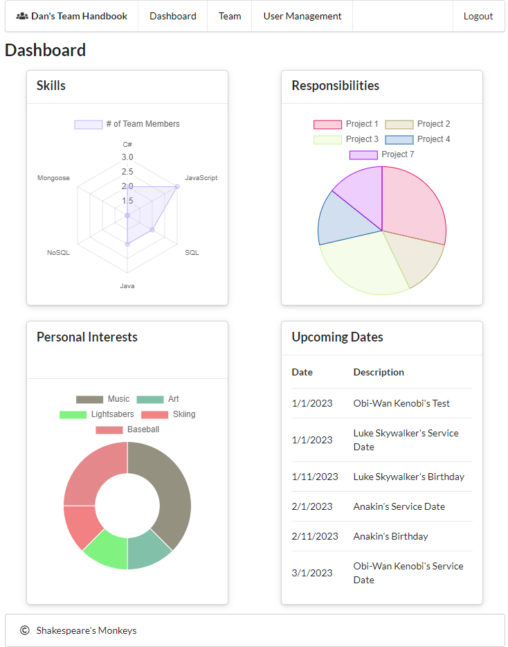
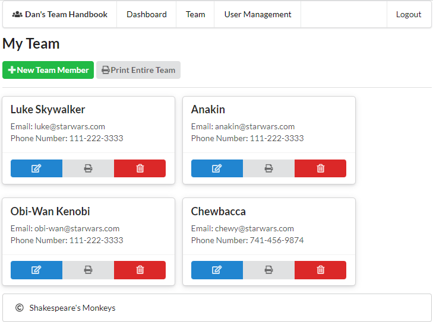
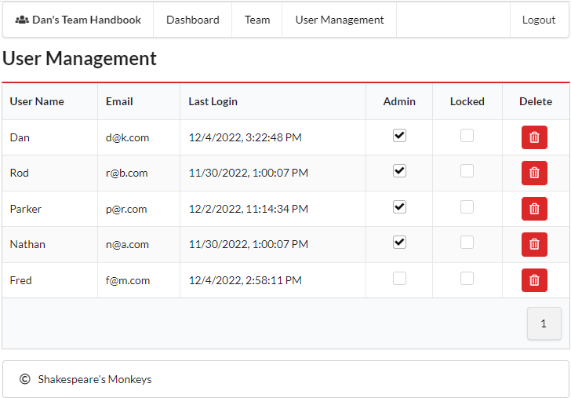

# 📒 Team Handbook

[](https://opensource.org/licenses/MIT)

## Overview
```
The code contained in this repository is a Team Handbook. Designed to put "People First"
in the office, this app will help managers and leaders of organizations 
to keep persoanlized data points of their employees at hand. Need to remember an employee's
birthday?  The Team Handbook will make sure you never forget.  Want to celebrate your employees'
anniversary with the company?  The Team Handbook will make sure you get that date correct. Need to
quickly check who among your team has the best skills for a specific project, Team Handbook has
got you covered.  Team Handbook will help you not only have the most useful data points available
for your employees, but will make them feel more valued within your organization which makes
Team Handbook a truly "People First" app.
```
### [https://shakespeares-monkeys.herokuapp.com/](https://shakespeares-monkeys.herokuapp.com/)

## Table Of Contents
- [Acceptance Criteria](#acceptance-criteria)
- [Static Screenshots](#static-screenshots)
- [Challenges](#challenges)
- [Future Development](#future-development)
- [Liscense](#liscense)
- [Contributing](#contributing)
- [Technology Used](#technology-used)
- [Contact Info](#contact-info)

## Acceptance Criteria
```md
WHEN I visit the site
THEN I am presented with the login page where I am able to login in or create an account

WHEN I create an account
THEN the system prompts me for a username, email, password.

WHEN I visit the “My Team Members” page
THEN I see a list of the people I have previously entered on my team, a link to view/edit/print each person’s information, a link to export/print the entire team’s information, a link to remove a person from the team, and a link to add a person to the team.

WHEN I visit the Add/Edit Team Member page
THEN I am able to input data about the team member.
This data would include:
-	Name
-	Picture
-	Contact Info: Email address, phone number, mailing address
-	Emergency POC Info: Name & Phone Number
-	Family Situation: spouse, children, etc.
-	Important Dates, e.g. birthday, anniversary, on-board date, etc.
-	Experience / Resume
-	Professional Skills
-	Responsibilities & Projects, both current and completed.
-	Training, both completed and upcoming
-	Personal Interests, e.g. Biking, Movies, etc.
-	Notes

WHEN I visit my Dashboard page
THEN I see charts that aggregate data from my team.
Example charts include:
-	Upcoming Important Dates from among my team
-	# of team members on each current project
-	# of team members that share personal interests
-	# of team members that share professional skills
```

## Static Screenshots







## Challenges

## Future Development

## License

[](https://opensource.org/licenses/MIT)

## Contributing
[](code_of_conduct.md)

## Technology Used
- [Reactjs](https://reactjs.org/): Front-end development
- [Nodejs](nodejs.org): Server-side javascript development
- [Express.js](https://expressjs.com/): Web server
- [Heroku](https://www.heroku.com/): Web server deployment
- [CryptoJS](https://cryptojs.gitbook.io/docs/): Encryption at Rest 
- [ChartJS](https://react-chartjs-2.js.org/): Data Visualization
- [Semantic-UI](https://react.semantic-ui.com/): React Component Library
- [Apollo GraphQL](https://www.apollographql.com/): GraphQL API calls
- [MongoDB](https://www.mongodb.com): NoSQL data storage
- [Mongoose](https://mongoosejs.com/): Data Modeling
- [JavaScript Web Tokens](https://jwt.io/): Authentication

## Contributors
- [Dan Kelly](https://github.com/dpk5e7): Project Manager, Charts, Auth
- [Nathan Aramyan](https://github.com/shniglehosen): Tables and Routes
- [Parker Riddle](https://github.com/Priddle88): UI Styling
- [Rod Bennett](https://github.com/RodBennett): Navigation and Routers
